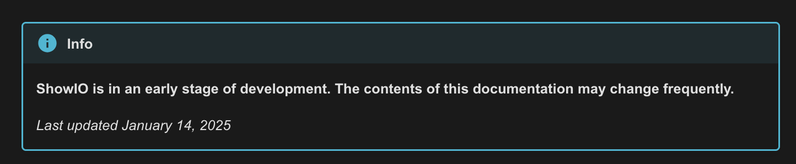

# Show Technologies Docs

This repository holds the documentation source for all Show Technologies products.  

Docs are built with [Material for MkDocs](https://squidfunk.github.io/mkdocs-material/), which extends [MkDocs](https://www.mkdocs.org/). This is how we turn Markdown files into an HTML webpage.

The website is currently hosted on [docs.show-technologies.com](docs.show-technologies.com) through GitHub pages.

## Running a Dev Server

Follow the [MkDocs installation guide](https://www.mkdocs.org/getting-started/). Make sure you have Python installed.  

After MkDocs is installed, run `mkdocs serve` from the command line. This will build and run a local dev instance of the MkDocs webpage which you can view from a browser. MkDocs doesn't have hot reload, so be sure to `ctrl + c` the dev server and restart it (and reload your browser) whenever you want to see your changes.

## Project Structure

`mkdocs.yml`: defines the MkDocs project and site navigation tree

`docs/`: contains all markdown document files, assets, CSS stylesheet, and CNAME DNS specifier   

`includes/`: contains markdown files that should not show up in the actual documentation (e.g. glossary definitions)

`scripts/`: contains formatting scripts

## Contribution Guide

The following instructions describe how to contribute content to the Docs.

### Site Navigation & Documentation Structure
Site navigation is declared in the `nav` section of `mkdocs.yml` independent of the actual folder/file structure in the `docs/` folder.  

MkDocs navigation is defined in YAML format. To create a page that shows up in navigation, a YAML line should be added with the format:

```yaml
- Page Title: path/to/doc.md
```

To create a section that contains sub-pages and/or sub-sections, a YAML line should be added with just a section title:

```yaml
- Section Title:
    - SubPage Tite: /path/to/subpage.md
    # ... more subpages or subsections
```

#### Example
```yaml
nav:
  - Home: index.md # top-level page
  - ShowIO API: # top-level section
    - Overview: osc_api/overview.md # subpage
    - Configuration Commands: # subsection
      - Overview: osc_api/configuration_commands/overview.md
      - Get Device Config: osc_api/configuration_commands/get_device_config.md
        # ...
    - Discovery Commands:
      - Overview: osc_api/discovery_commands/overview.md
      - Device Discovery: osc_api/discovery_commands/device_discovery.md
        # ...
    - I/O Commands:
      - Overview: osc_api/io_commands/overview.md
      - Set Digital Output: osc_api/io_commands/set_digital_output.md
        # ...
```

### Adding Content
To add a new page, create a `.md` file within the `docs/` folder, and add Markdown content. Add the page in the Navigation section in `mkdocs.yml`, and you're done!.

### OSC API Structure
The folder `docs/osc_api/` contains all of the OSC API markdown that is generated from the comments in ShowIO source code.

**Do NOT make any edits to any pages in subfolders of this folder.** Since this content is pulled from the ShowIO source code files, any manual changes will be overwritten on the next commit.

It's safe to modify `docs/osc_api/overview.md` or add pages to the top-level `osc_api` folder.

The script `auto_generate_tree.py` automatically changes the MkDocs navigation tree based on the folder structure of `osc_api`. This lets us avoid manually changing the navigation tree whenever we change the OSC API structure.

### Markdown Features
A basic markdown guide can be found [here](https://www.markdownguide.org/cheat-sheet/), but Material for MkDocs has a bunch of cool advanced features that we can use to make the docs look great.

#### Icons


Icons can be inserted into Markdown documents with icon codes that can be found at https://squidfunk.github.io/mkdocs-material/reference/icons-emojis/. The examples in the image are:

```markdown
:fontawesome-solid-lightbulb:

:fontawesome-solid-book:

:fontawesome-solid-microchip:
```

Use only icons from the fontawesome-solid family where possible. 


#### Call Outs (Admonitions)

Callouts can be added to a page with the following markdown:

```markdown
!!! [type]

    This is content that will be in the callout.

```

Note the indentation and the line spacing.  

Currently supported callout types are `!!! info` and `!!! warning`. This will not show up in most Markdown previews, as it's special MkDocs syntax.  

Use info callouts to highlight meta-information.

Use warning callouts to highlight potentially dangerous or unstable information, or warn the users of important constraints.

### Style Guide
Please adhere to the following conventions to standardize our documentation:

- All commands, code, and other technical data (OSC addresses, payloads, etc) should be wrapped in `code blocks`